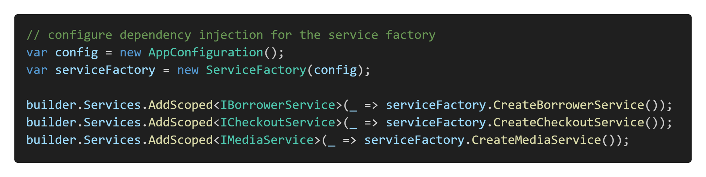

# Exercise: REST API for Library Manager

We've used the Library API as an example to wire up the borrower endpoints. In this exercise, you will finish the API. You may use the solution and projects in the **\WebAPI\Exercises\01-Library-Manager\Start\\** folder as your starting point.

## Requirements

Add an ASP.NET Core empty template project to the existing solution and name it **LibraryManagement.API**. You will need to reference the Application project.

### AppConfiguration Class

Because we need access to the application configuration settings, we must duplicate the **AppConfiguration.cs** class from the **ConsoleUI** project.

### Dependency Injection

Inside the controllers, you will need to reference service interfaces rather than the concrete implementations of the services. The existing **ServiceFactory** class handles the creation of the instances. We can leverage that with the **builder** variable. Because we haven't shown you how to bind a dependency to a factory, we will give you the code:

You may use any existing repositories to implement the solution, whether they use ADO.NET/Dapper or Entity Framework. You can also retain the logic where the database type is configurable via the `appsettings.json` file.

## Add REST API Endpoints

You will need to add REST API endpoints for all actions that the existing Library Manager application can perform. You will need to add appropriate validation and HTTP response codes for each endpoint.

You will need to adhere to the **thin controller principles**, which means that no business logic should exist in the controller methods directly. Instead, we will need to invoke appropriate methods on the services (borrowers, checkout, and media) you created previously. You will also need to adhere to the **dependency inversion principle**, which means that you will need to inject the service interfaces into the controllers rather than concrete service classes. The mapping between the interfaces and classes should be done by registering them as transient dependencies in the application startup code.

Also, each endpoint address needs to be prefixed with the `api` path, as this is a common convention for REST APIs.

We need to implement the following endpoints:

| Endpoint Description                                         | HTTP Method | URL Pattern                |Response Codes                           |
| ------------------------------------------------------------ | ----------- | -------------------------- |---------------------------------------- |
| List all borrowers                                           | GET         | `/api/borrowers`           | `200`                                   |
| View a borrower                                              | GET         | `/api/borrowers/{email}`   | `200`, `404` (borrower is not found) |
| Add a borrower                                               | POST        | `/api/borrowers/`          | `201`, `409` (borrower already exists) |
| Edit a borrower                                              | PUT         | `/api/borrowers/{borrowerId}` | `204`, `409` (borrower with the same email already exists) |
| Delete a borrower                                            | DELETE      | `/api/borrowers/{borrowerId}` | `204`, `409` (borrower with the same email already exists) |
| List available media                                         | GET         | `/api/checkout`            | `200`                                   |
| List checked out media                                       | GET         | `/api/checkout/log`        | `200`                                   |
| Checkout a media item                                        | POST        | `/api/checkout/media/{mediaId}` | `201`, `404` (borrower is not found), `409` (any other validation error) |
| Return a media item                                          | POST        | `/api/checkout/returns/{checkoutLogId}` | `204`, `409` (item is no longer checked out) |
| List all media types                                         | GET         | `/api/media/types`          | `200`                                 |
| List all media by type                                       | GET         | `/api/media/types/{mediaTypeId}` | `200`                               |
| List the most popular media                                  | GET         | `/api/media/top`            | `200`                                 |
| List archived media                                          | GET         | `/api/media/archived`       | `200`                                 |
| Add media                                                    | POST        | `/api/media`                | `201`                                 |
| Archive media                                                | POST        | `/api/media/{mediaId}/archive` | `204`, `409` (item is already archived) |
| Edit media                                                   | PUT         | `/api/media/{mediaId}`      | `204`                                 |

## Add Swagger Documentation

Swagger documentation must enable the user to interact with all the above endpoints in the browser. For each endpoint, it needs to list the following: 

- The endpoint description is described in the table above.
- The possible response codes the endpoint can return (excluding 500). Use the **[ProducesResponseType]** attribute and cover the responses in the table above.